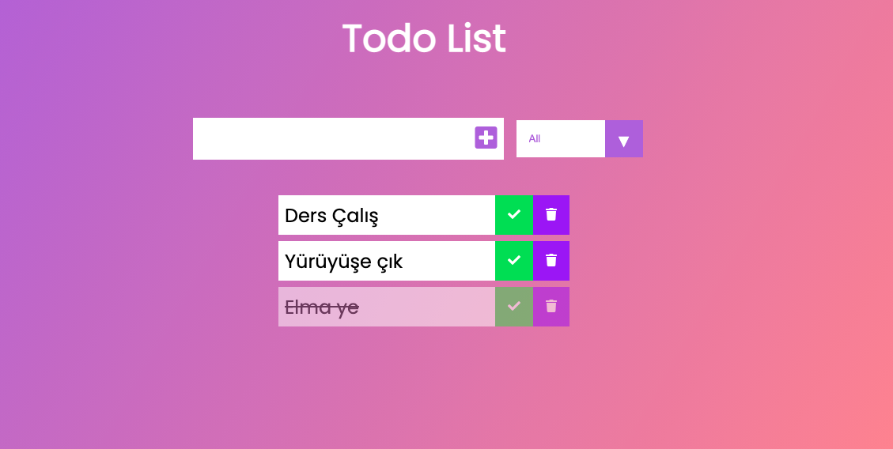

# To-Do-JS

[Click to see](https://ayerdelen.github.io/To-Do-JS/)

- Created Todo List with JS and really enjoyed it.

With this project I've learned:

- LocalStorage logic and usage,
- All the CRUD things in one application

